# pokedex

This project was intended as a gift to my little sisters who really love Pokemon.

## Getting Started

This project is one of my fisrt project with flutter. I use the PokeAPI to create this comprehensive dictionary about the world of Pokemon.

## UI

- Light mode
  

    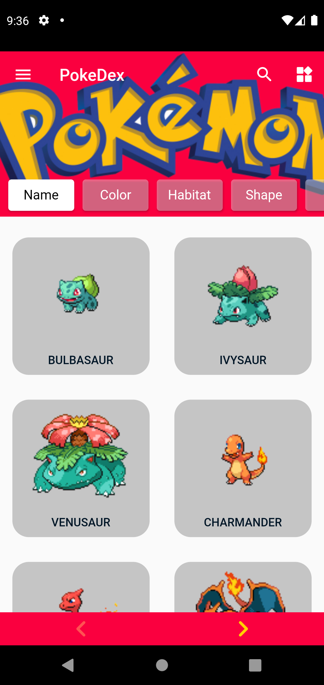
    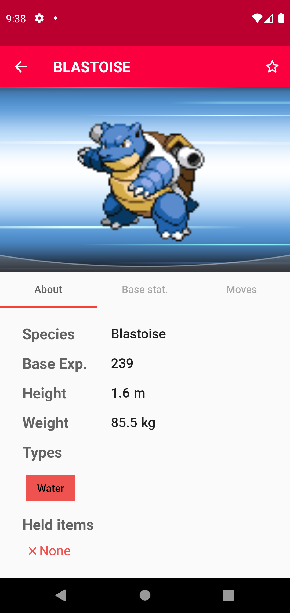 
    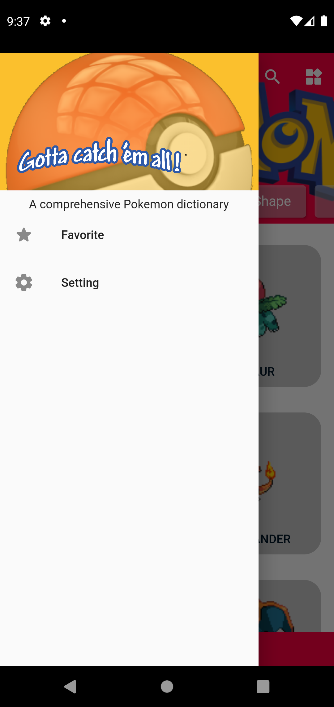 
    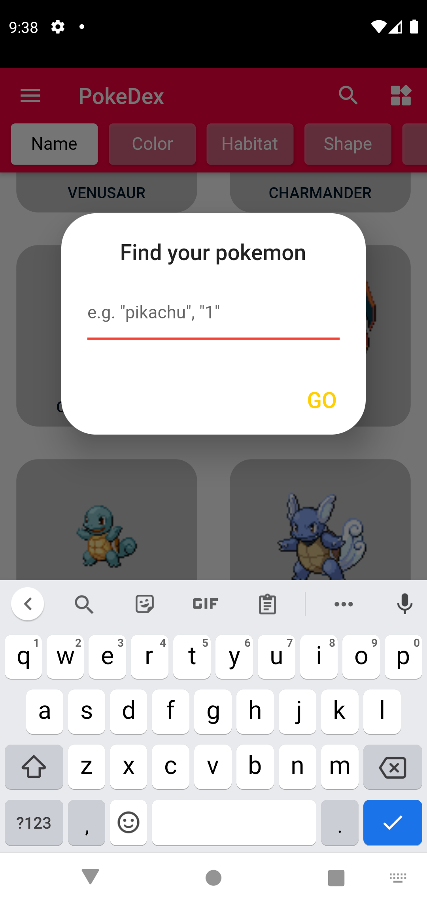 
  

- Dark mode
  

    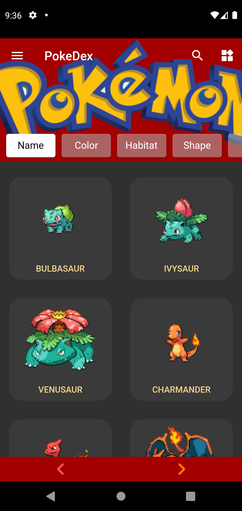
    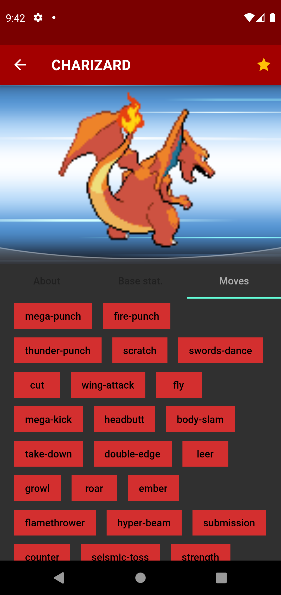 
    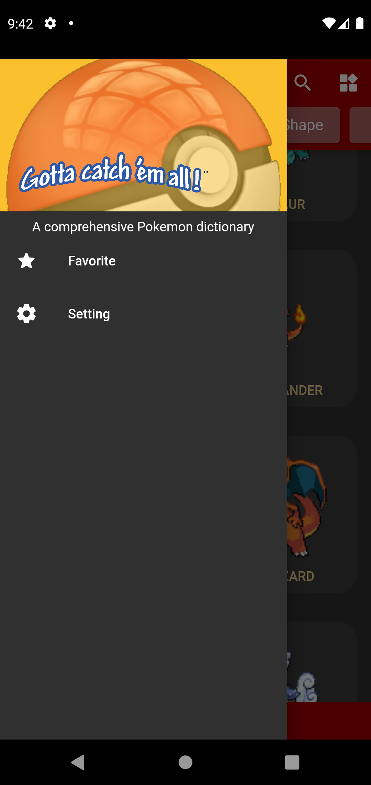 
    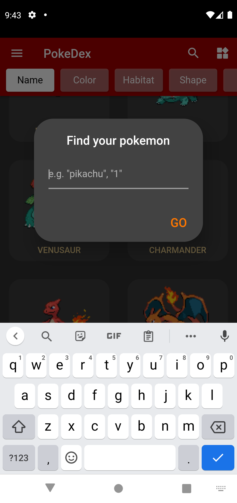 
  

## Features

- Comprehensive information about every pokemon
- Pokemons can be organised by many categories like color, habitat, shape,...
- Users can save their favorite pokemons by tapping the star button in the action bar (tap again to remove)
- Various setting can be accessed by the user to custom the app as the user like it to be (more setting coming in the future)
  

    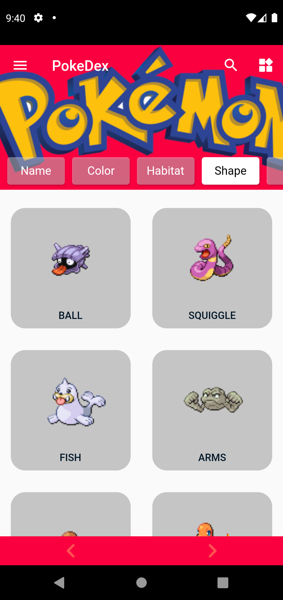
    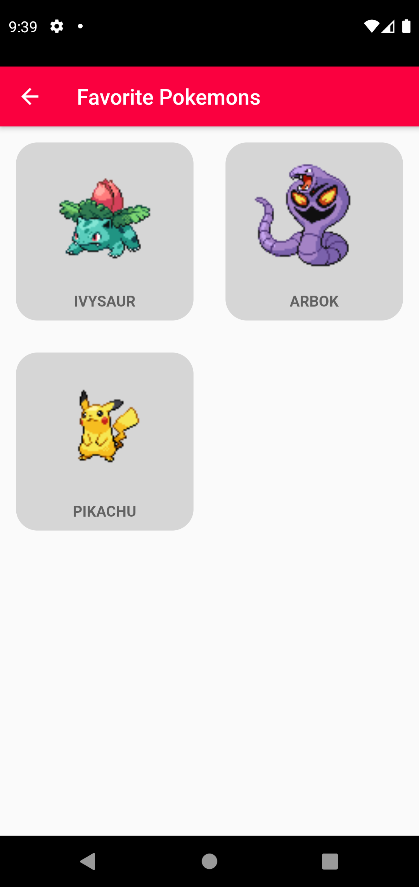
    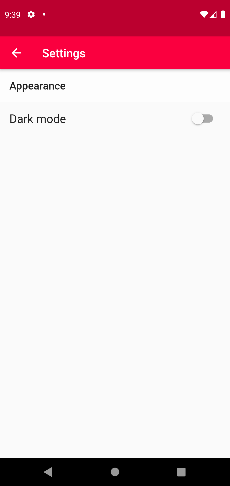
  

## Future upgrade
- [ ] Clean code
- [ ] UI enhancement (search bar, color theme)
- [ ] Animations
- [ ] More settings
- [ ] "Who's that pokemon" mode
- [ ] Localization (language setting)